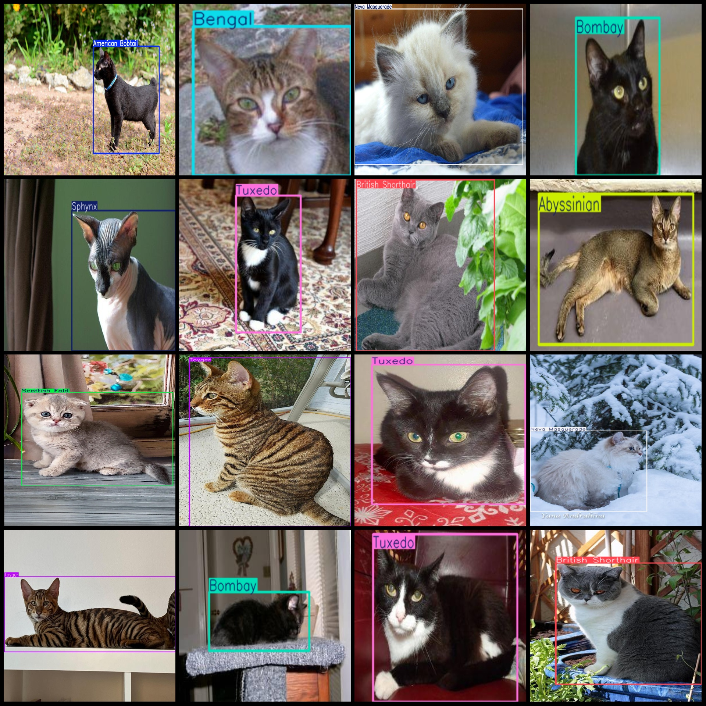
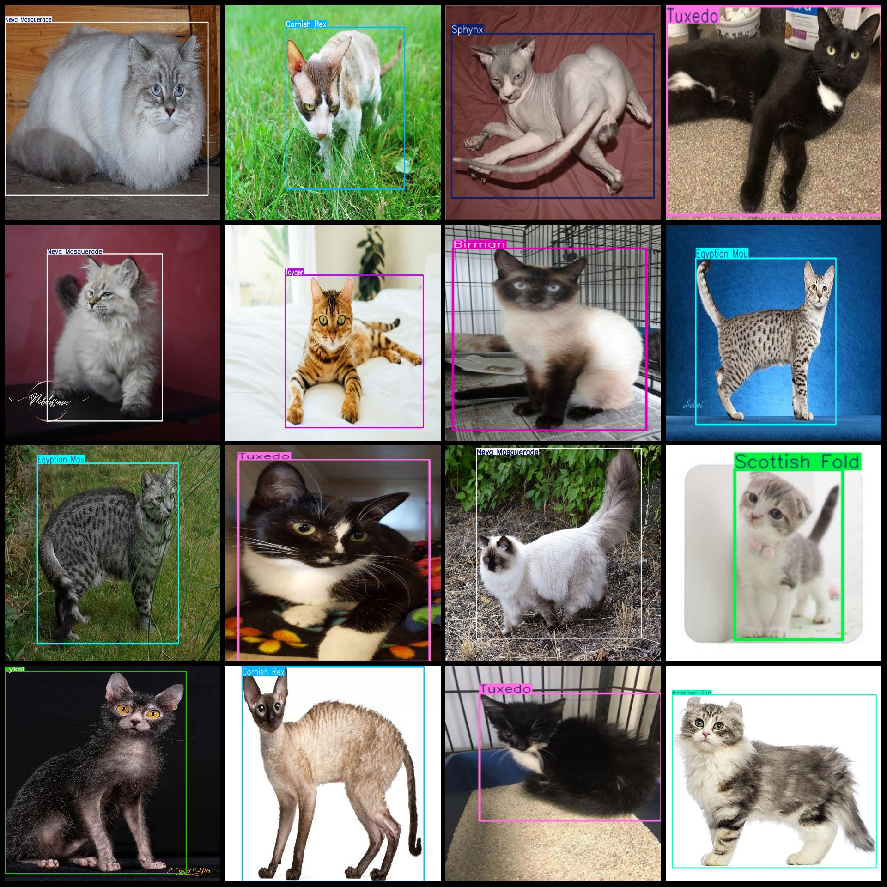

# Cat Species Identification and Detection Dataset VOC+YOLO format with 6967 images in 24 categories

Dataset format: Pascal VOC format + YOLO format (txt files without split paths, only containing jpg images and corresponding VOC format xml files and yolov3 format txt files)
Number of images (number of jpg files): 6967
Number of annotations (number of xml files): 6967
Number of annotations (number of txt files): 6967
Number of categories: 24
Category names for annotations (note that the order of categories in the yolov3 format does not correspond to this, but is based on the labels folder classes.txt): ["Abyssinian", "American Bobtail", "American Curl", "Bengal", "Birman", "Bombay", "British Shorthair", "Cornish Rex", "Egyptian Mau", "Khao Manee", "Lykoi"]
"Maine Coon","Munchkin","Neva Masquerade","Oriental","Persian","Ragdoll","Russian Blue","Savannah","Scottish Fold","Siamese","Sphynx","Toyger","Tuxedo"]  
Number of boxes labeled in each category:
The Abyssinian cat is a breed of cat originating from the region of Ethiopia, which has a distinct appearance. It is known for its short, thick fur and large ears that are often set on top of its head. The box count refers to the number of boxes in an image, which can be used to determine the size and complexity of an object. In this case, the box count for the Abyssinian cat is 275, indicating that there are 275 boxes in the image.
American Bobtail (US) Frame count = 323
American Curl (American Curly) box count = 252  
Bengal (Bengal Cat) box count = 351  
Birman (Birman) box count = 349  
Bombay (Bombay Cat) box count = 331  
British Shorthair (British Shorthair) box count = 272
Cornish Rex (Cornish Rex) frame count = 330
Egyptian Mau Frame Count = 261
Khao Manee is a breed of cat. The box count is the number of boxes that a cat can fit into. In this case, Khao Manee has a box count of 230.
Lykoi (wolfcat) frame count = 248
Maine Coonbox count = 333
Munchkinbox count = 224
Neva Masquerade (Nevada Mask Cat) frame count = 351
Orientalbox count = 220
Persianbox count = 324
Ragdollbox count = 310
Russian Bluebox count = 338
Savannahbox count = 239
Scottish Foldbox count = 402
Siamesebox count = 365
Sphynxbox count = 331
Toyger frame count = 222
"Tuxedo" is a type of suit, and "cat" is a common term for cats. So the phrase "Tuxedo box count = 350" might refer to the number of frames or images that have been created with the Tuxedo theme.
Total frames: 7231.
Image resolution: Multi-resolution images, such as 500x333, 300x225, etc.
Use a labeling tool: LabelImg
Annotation rule: Draw a rectangle around the class.
Important Note: The dataset does not have a split into training, validation, and test sets.
This dataset does not guarantee the accuracy of any trained models or weights.
Image preview:
## Images

Here is a pay link on Stripe ( https://buy.stripe.com/3cs8yP7sY87d0vu9AB ). Please contact me lonlonago@foxmail.com after funding $89, and I will send you a complete data files , thank you!

